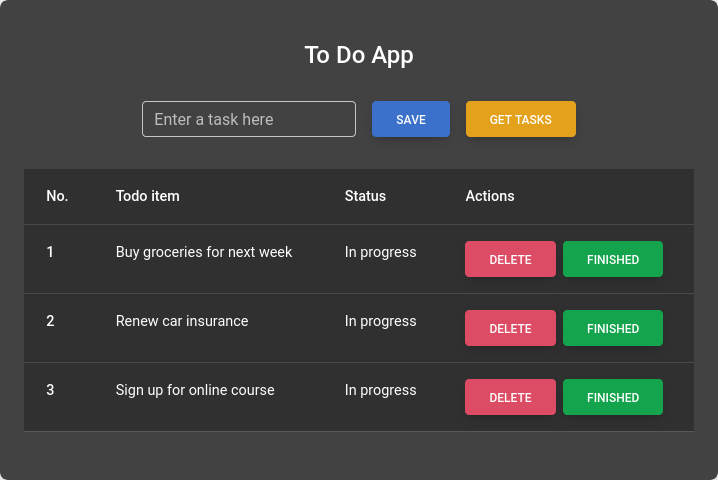

# [Todo List API](https://roadmap.sh/projects/todo-list-api)

In this project you are required to develop a RESTful API to allow users to manage their to-do list.
The previous backend projects have only focused on the CRUD operations,
but this project will require you to implement user authentication as well.

## Goals

-   [ ] Web Application
-   [ ] Schema design and Databases
-   [ ] CRUD operations
-   [ ] Error handling
-   [ ] User Authentication
-   [ ] Security

## Requirements

You are required to develop a RESTful API and a web application to allow users to manage their to-do list.

-   [ ] Implement a Web Application to interact with the API
-   [ ] User registration to create a new user
-   [ ] Login endpoint to authenticate the user and generate a token
-   [ ] CRUD operations for managing the to-do list
-   [ ] Implement user authentication to allow only authorized users to access the to-do list
-   [ ] Implement error handling and security measures
-   [ ] Use a database to store the user and to-do list data (you can use any database of your choice)
-   [ ] Implement proper data validation
-   [ ] Implement pagination and filtering for the to-do list

Given below is a list of the endpoints and the details of the request and response:

### User Registration

-   **Description:** Register a new user using the following request. This will validate the given details,
    make sure the email is unique and store the user details in the database.
    Make sure to hash the password before storing it in the database.
    Respond with a token that can be used for authentication if the registration is successful.
-   **Endpoint:** `POST /api/v1/users/register`
-   **Request:**
    ```json
    {
        "name": "John Doe",
        "email": "john@doe.com",
        "password": "password"
    }
    ```
-   **Response:**
    ```json
    {
        "token": "eyJhbGciOiJIUzI1NiIsInR5cCI6IkpXVCJ9"
    }
    ```

### User Login

-   **Description:** Authenticate the user using the following request.
    Validate the email and password and respond with a token if the authentication is successful.
-   **Endpoint:** `POST /api/v1/users/login`
-   **Request:**
    ```json
    {
        "email": "jonh@doe.com",
        "password": "password"
    }
    ```
-   **Response:**
    ```json
    {
        "token": "eyJhbGciOiJIUzI1NiIsInR5cCI6IkpXVCJ9"
    }
    ```

### Create a To-Do Item

-   **Description:** Create a new to-do item for the authenticated user.
    Make sure to validate the request and store the to-do item in the database.
    User must send the token received from the login endpoint in the header to authenticate the request.
    You can use the Authorization header with the token as the value.
    In case the token is missing or invalid, respond with an error and status code 401.
    ```json
    {
        "message": "Unauthorized"
    }
    ```
-   **Endpoint:** `POST /api/v1/todos`
-   **Request:**
    ```json
    {
        "title": "Buy groceries",
        "description": "Buy milk, eggs and bread"
    }
    ```
-   **Response:**
    ```json
    {
        "id": 1,
        "title": "Buy groceries",
        "description": "Buy milk, eggs and bread"
    }
    ```

### Update a To-Do Item

-   **Description:** Update an existing to-do item for the authenticated user.
    Make sure to validate the request and update the to-do item in the database.
    User must send the token received from the login endpoint in the header to authenticate the request.
    Just like the create todo endpoint, user must send the token received.
    Also make sure to validate the user has the permission to update the to-do item i.e.
    the user is the creator of todo item that they are updating.
    Respond with an error and status code 403 if the user is not authorized to update the item.
    ```json
    {
        "message": "Forbidden"
    }
    ```
-   **Endpoint:** `PUT /api/v1/todos/:id`
-   **Request:**
    ```json
    {
        "title": "Buy groceries",
        "description": "Buy milk, eggs and bread"
    }
    ```
-   **Response:**
    ```json
    {
        "id": 1,
        "title": "Buy groceries",
        "description": "Buy milk, eggs and bread"
    }
    ```

### Delete a To-Do Item

-   **Description:** Delete an existing to-do item for the authenticated user.
    User must be authenticated and authorized to delete the to-do item.
    Upon successful deletion, respond with the status code 204.
-   **Endpoint:** `DELETE /api/v1/todos/:id`
-   **Response:** `Status code 204`

### Get To-Do Items

-   **Description:** Get all the to-do items for the authenticated user.
    User must be authenticated to access the to-do items.
    Implement pagination and filtering to allow the user to get the to-do items in a paginated manner.
    User can send the page number and limit as query parameters to get the to-do items.
    Respond with the to-do items and the total count of items.
-   **Endpoint:** `GET /api/v1/todos?page=1&limit=10`
-   **Response:**
    ```json
    {
        "total": 2,
        "page": 1,
        "limit": 10,
        "items": [
            {
                "id": 1,
                "title": "Buy groceries",
                "description": "Buy milk, eggs and bread"
            },
            {
                "id": 2,
                "title": "Pay bills",
                "description": "Pay electricity and water bills"
            }
        ]
    }
    ```

## Bonus

-   [ ] Implement logging for the API
-   [ ] Implement filtering and sorting for the to-do items
-   [ ] Implement rate limiting and throttling for the API
-   [ ] Implement refresh token mechanism for the authentication
-   [ ] Implement unit tests for the API
-   [ ] Implement integration tests for the API
-   [ ] Implement API documentation using Swagger or Postman
-   [ ] Implement Docker support for the API
-   [ ] Implement CI/CD pipeline for the API
-   [ ] Implement caching for the API

## [Base Layout](https://mdbootstrap.com/docs/standard/extended/to-do-list/#section-3)

<div align="center">
    
</div>
